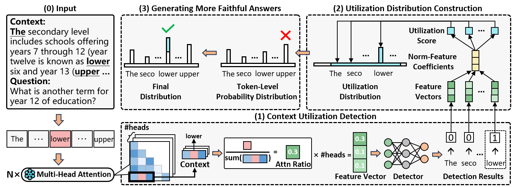
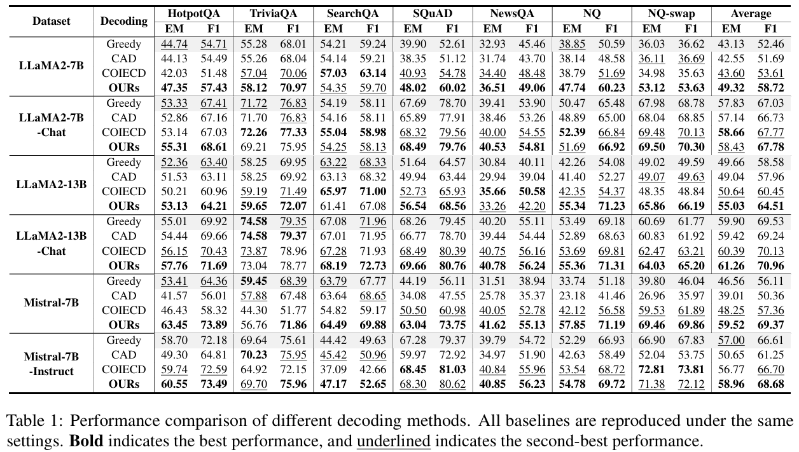

# Dynamic Attention-Guided Context Decoding for Mitigating Context Faithfulness Hallucinations in Large Language Models

## 🔍Overview

The official code for the paper 📃:

<p align="center">
<a href="https://arxiv.org/abs/2501.01059">《Dynamic Attention-Guided Context Decoding for Mitigating Context Faithfulness Hallucinations in Large Language Models》</a>



## 📊Evaluation Results




## 🎯Quick Start

### :one:Clone this repo

```shell
git clone https://github.com/uestc-huangyw/DAGCD.git
cd DAGCD/src
```


### :two:Install dependencies

```shell
# step 1: create a virtual environment
conda create -n dagcd python=3.9

# step 2: activate the virtual environment
conda activate dagcd

# step 3: install dependencies from requirements.txt
python -m pip install -r requirements.txt
```


### :three:Download Data

We download QA datasets from [MrQA](https://huggingface.co/datasets/mrqa-workshop/mrqa) and [NQ-Swap](https://huggingface.co/datasets/pminervini/NQ-Swap), and we use MrQA train set for training Context Utilization Detector and validation set for evaluation. We also download the summary dataset from [CNN_DM](https://huggingface.co/datasets/abisee/cnn_dailymail).

```shell
python 0_pre_data.py

# data will be saved in ../datasets/
```

---


### :four:Train Context Utilization Detector

Training the Context Utilization Detector for the specific LLM.

```shell
python 1_train_detector.py --model {huggingface_id} --hf_token {hf_token}
```

- `huggingface_id`: the Hugging Face ID of the LLM.
- `hf_token`: the hugging face user token.

**Example**：

```shell
# set cuda devices
export CUDA_VISIBLE_DEVICES=0  # single device
export CUDA_VISIBLE_DEVICES=0,1  # multiple devices (Note! This only splits the model across multiple devices. It does not split the data.)

python 1_train_detector.py --model meta-llama/Llama-2-7b-hf
python 1_train_detector.py --model meta-llama/Llama-2-7b-hf

# LLM model will be saved in ../models/llama-2-7b-hf (the model filename is the lowercase basename of the huggingface_id).
# Context Utilization Detector will be saved in ../dector/
```

---


### :five:Apply DAGCD during Inference-Time

Apply Dynamic Attention-Guided Context Decoding during inference-time.

```shell
python 2_DAGCD.py --model {model_name} --data {dataset_name} --topk {topk features} --top_rank {top_rank}
```

- `model_name`: the lowercase basename of the LLM's Hugging Face ID.
- `dataset_name`: the QA dataset names.
  - options: `HotpotQA`, `TriviaQA-web`, `SearchQA`, `SQuAD`, `NewsQA`, `NaturalQuestionsShort`, `NQ-swap`
- `topk`: the topk feature coefficient detector, set `10` for default.
- `top_rank`: the top-rank filtering, set `10` for default.

**Example:** 

```shell
# set cuda devices
export CUDA_VISIBLE_DEVICES=0  # single device
export CUDA_VISIBLE_DEVICES=0,1  # multiple devices (Note! This only splits the model across multiple devices. It does not split the data.)

python 2_DAGCD.py --model llama-2-7b-hf --data HotpotQA --rank 10
python 2_DAGCD.py --model llama-2-7b-hf --data HotpotQA --rank 10

# the results will be saved in ../results/llama-2-7b-hf/
```

---


## 📌Citation

If you find the repository or paper helpful, please cite our work:

```bibtex
@article{huang2025dynamic,
  title={Dynamic Attention-Guided Context Decoding for Mitigating Context Faithfulness Hallucinations in Large Language Models},
  author={Huang, Yanwen and Zhang, Yong and Cheng, Ning and Li, Zhitao and Wang, Shaojun and Xiao, Jing},
  journal={arXiv preprint arXiv:2501.01059},
  year={2025}
}
```