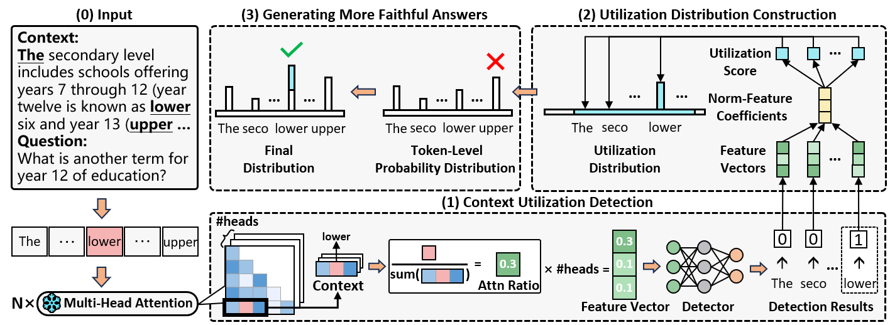

# Code will coming soon

The official code for the paper "[Dynamic Attention-Guided Context Decoding for Mitigating Context Faithfulness Hallucinations in Large Language Models](https://arxiv.org/abs/2501.01059)".




# Quick Start

## Clone this repo

```sh
git clone https://github.com/uestc-huangyw/DAGCD.git
cd DAGCD/src
```


## Install dependencies

```sh
# step 1: create a virtual environment
conda create -n dagcd python=3.9
# step 2: activate the virtual environment
conda activate dagcd
# step 3: install dependencies from requirements.txt
pip install -r requirements.txt
```


## Step 0: Download Data

We download QA datasets from [MrQA](https://huggingface.co/datasets/mrqa-workshop/mrqa) and [NQ-Swap](https://huggingface.co/datasets/pminervini/NQ-Swap), and we use MrQA train set for training Context Utilization Detector and validation set for evaluation. And we download summary dataset from [CNN_DM](https://huggingface.co/datasets/abisee/cnn_dailymail).

```sh
python 0_pre_data.py --save_dir ../datasets/original_data/
```

---


## Step 1: Train Context Utilization Detector

Training the Context Utilization Detector for the specific LLM.

```shell
python 1_train_detector.py --model {huggingface_id} --hf_token {hf_token} --gpu {device_id}
```

- `huggingface_id`: the Hugging Face ID of the LLM.
- `hf_token`: the hugging face user token.
- `device_id`:  the GPU device IDs, use a single ID for single-card setups, and multiple IDs separated by `,` for multi-card setups.

**Example**：

```sh
python 1_train_detector.py --model meta-llama/Llama-2-7b-hf --gpu 0  # single device
python 1_train_detector.py --model meta-llama/Llama-2-7b-hf --gpu 0,1  # multi devices

# LLM model will saved in ../models/llama-2-7b-hf (the model filename is the lowercase basename of the huggingface_id).
# Context Utilization Detector will saved in ./dector/
```

---


## Step 2: Apply DAGCD during Inference-Time

Applying Dynamic Attention-Guided Context Decoding during inference-time.

```shell
python 2_DAGCD.py --model {model_name} --data {dataset_name} --rank {top-rank} --gpu {device_id}
```

- `model_name`: the lowercase basename of the LLM's Hugging Face ID.
- `dataset_name`: the QA dataset names.
  - options: HotpotQA, TriviaQA-web, SearchQA, SQuAD, NewsQA, NQ, NaturalQuestionsShort, NQ-swap 
- `top-rank`: the top-rank filtering, set `10` for default.
- `device_id`:  the GPU device IDs, use a single ID for single-card setups, and multiple IDs separated by `,` for multi-card setups.

**Example:** 

```sh
python 2_DAGCD --model llama-2-7b-hf --data HotpotQA --rank 10 --gpu 0

# the results will saved in ../results/llama-2-7b-hf/
```

---


# Citation

```

```

